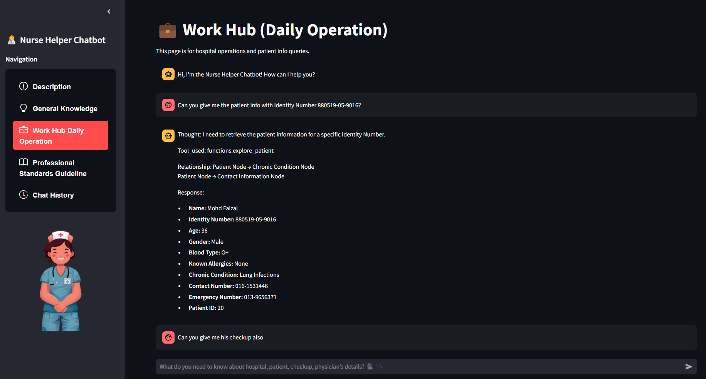

= Nurse Helper Chatbot powered by RAG and Agent - Final Year Project

# Project Overview

This repository hosts an **Intelligent Nurse Helper Chatbot** designed to support interim nurses with real-time access to patient, physician, checkup, and hospital information. Built using Neo4j, LLMs (OpenAI),Retrieval-Augmented Generation (RAG) and React Agent, it streamlines workflows, offers decision support, and reinforces nursing standards. The goal is to reduce complexity and fragmentation in healthcare systems, thereby enhancing the efficiency and confidence of nurses in their day-to-day tasks.")

## Key Highlights

- **Patient Data Retrieval**  
  Quickly fetch patient info based on multiple identifiers.

- **Physician & Hospital Search**  
  Locate physicians by name, specialty, or license, and find hospitals by location or services offered.

- **Checkup Management**  
  Access details about patient checkups, assigned rooms, urgency levels, and physician involvement.

- **Nursing Standards**  
  Reinforce best practices, infection control, shift systems, and admission/discharge procedures.

- **General Medical Queries**  
  Provide quick definitions, guidelines, and answers to assist interim nurses in learning and decision-making.

## Why It Matters

- **Reduces Administrative Overload**  
  Consolidates fragmented systems into a single intuitive platform.

- **Accelerates Decision-Making**  
  Offers real-time support with actionable insights.

- **Promotes Confidence & Competence**  
  Helps nurses adapt more quickly to real-world care settings.

## Technologies

- **Neo4j** (Graph Database)
- **Large Language Models (OpenAI)**
- **Retrieval-Augmented Generation (RAG) and React Agent**

== Screenshots

=== 1. Description Page
image::./assets/description.png[Description Page]

=== 2. Work Hub (Daily Operation)

=== 3. Professional Standards Guideline

