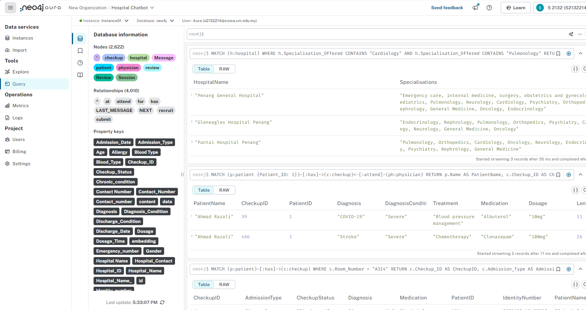

This directory contains Cypher examples for the chatbot's integration with Neo4j. 
It includes Cypher queries for managing hospital nodes, patient nodes, checkup nodes, and physician nodes in the database.
All these cypher examples have been tested in Neo4j Aura instance

Graph Database Schema

Node properties:

-hospital {Hospital_ID: INTEGER, State: STRING, Hospital_Contact: STRING, Hospital_Name: STRING, Specialisation_Offered: STRING}
-checkup {Hospital_ID: INTEGER, Checkup_ID: INTEGER, Admission_Type: STRING, Checkup_Status: STRING, Admission_Date: STRING, Discharge_Date: STRING, Discharge_Condition: STRING, Length_of_Stay (LOS): INTEGER, Diagnosis: STRING, Diagnosis_Condition: STRING, Test_Results: STRING, Treatment: STRING, Medication: STRING, Dosage: STRING, Dosage_Time: STRING, Specialisation: STRING, Physician_ID: INTEGER, Patient_ID: INTEGER, Room_Number: STRING}
-physician {Hospital_ID: INTEGER, Physician_ID: INTEGER, Specialization: STRING, License_Number: INTEGER, Physician_Name: STRING, Physician_Contact: STRING}
-review {Hospital_ID: INTEGER, Checkup_ID: INTEGER, Patient_ID: INTEGER, Review_ID: INTEGER, Review: STRING, embedding: LIST}
-patient {Patient_ID: INTEGER, Name: STRING, Identity_number: STRING, Age: INTEGER, Emergency_number: STRING, Allergy: STRING, Chronic_condition: STRING, Gender: STRING, Patient_Contact: STRING, Blood_Type: STRING}
-Session {id: STRING}
-Message {type: STRING, content: STRING}

Relationship properties:

(:hospital)-[:recruit]->(:physician)
(:checkup)-[:at]->(:hospital)
(:physician)-[:attend]->(:checkup)
(:review)-[:for]->(:hospital)
(:patient)-[:has]->(:checkup)
(:patient)-[:submit]->(:review)
(:Session)-[:LAST_MESSAGE]->(:Message)
(:Message)-[:NEXT]->(:Message)

